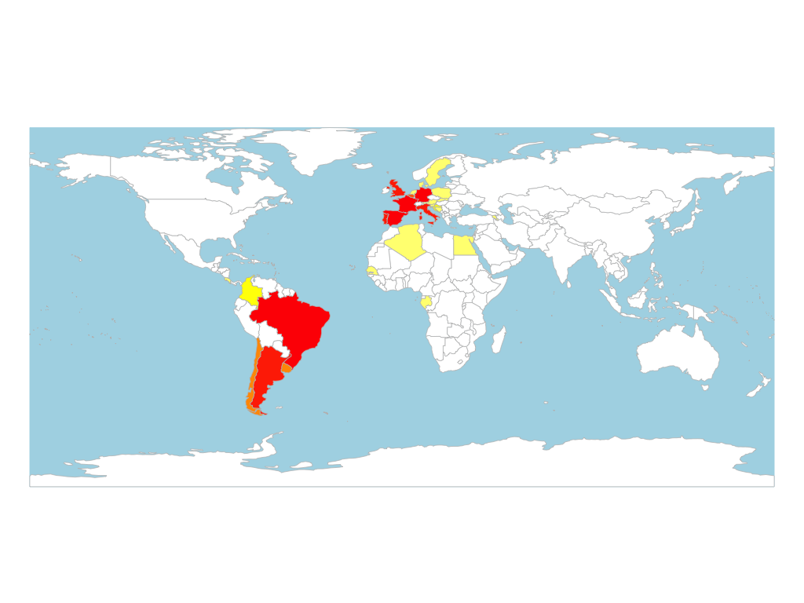
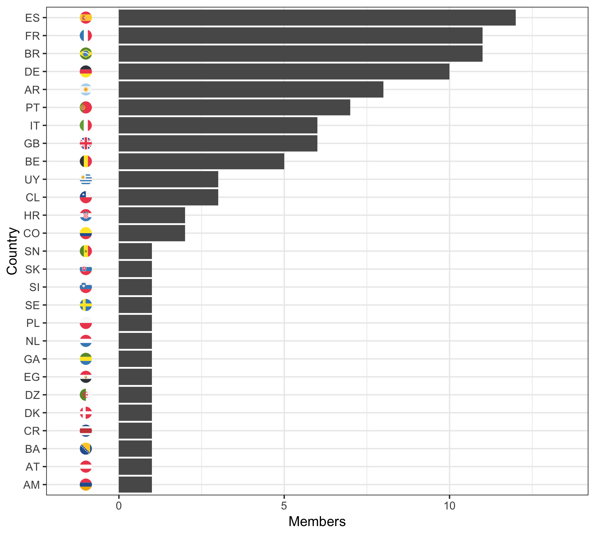

# Maps-N-Flags
_Making graphics to show where people come from._

An R script that takes a csv file and generates:

1. heat map of the world
2. bar chart of origins using flags as axis labels

An example csv file is included, `exampleData.csv`. This file has the country of origin for the [Guardian's Top 100 Footballers as voted by readers in 2016](https://docs.google.com/spreadsheets/d/12n0Nu9Uu7CCG_w4sTbhFzijeAKhMbXgkzxkRKlg7vb4/edit#gid=885154705).

Using `mapOrigins.R` a heat map:

and a bar chart will be saved in working directory.

### flagEmojis

In `flagEmojis` there is a python script which will take a csv of ISO2 country codes and print them as a string of Flag Emojis.